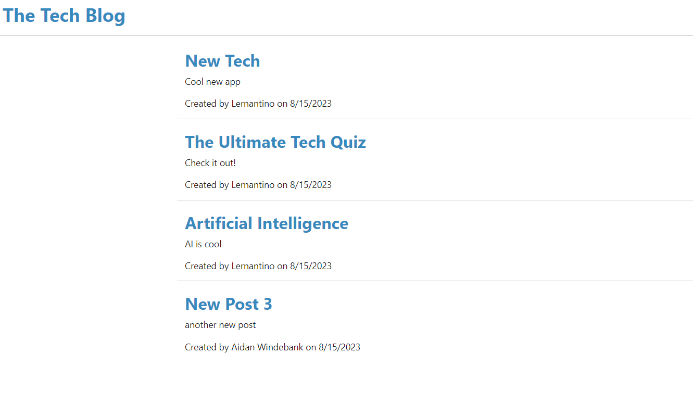

# Tech Blog
The following is a CMS style Tech Blog for software developers to collaborate and share ideas.

## Purpose of Assignment
 - This web app serves to act as a WordPress style blog where users can post, comment and read other software developer's posts. 
 - Someone visting the site can see a list of all the posts, and then if they sign up for an account they can create and update their own posts, and comment on other users posts. 
 - When a user does not have an account they must sign up for one. Once they are signed up, they will remained signed in on the website for a certain ammount of time. If their session expries or they revist the site at a later time the user will need to sign in again. 

## Instructions for the User
 - Please use app and comment on any errors.

## Screen Shot of Working Application

## Link to GitHub Repository
[Click Here to View GitHub Repo](https://github.com/Aidan-Windebank/tech-blog)

## Link to Deployed Web Application
[Click Here to Visit Web Application](https://aidan-tech-blog-c68ddbbc814c.herokuapp.com/)